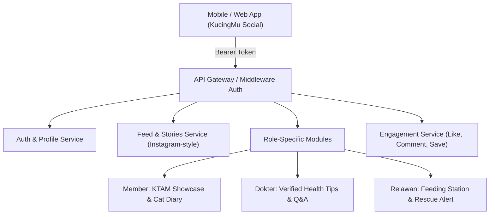

# 🐱 KucingMu Social Apps — API Specification & Architecture Document
**Version:** `1.0.0-draft`  
**Base URL:** `https://kucingmu.online/api/v1`  
**Authentication:** Bearer Token (Laravel Sanctum / JWT)  
**Format:** JSON (Request & Response)  

---

## 📌 1. Ikhtisar & Arsitektur

**KucingMu Social Apps** adalah platform media sosial komunitas yang terintegrasi dengan ekosistem **kucingmu.online**. Mengadopsi pola interaksi familiar dari **Instagram** (Feed, Carousel, Likes, Comments, Saved, Stories, Direct Chat) yang dipadukan dengan fitur inti KucingMu seperti **Profil KTAM Digital, Edukasi Dokter Hewan, serta Sensus & Rescue Kucing Liar Relawan**.



### Role & Badges Ekosistem
| Role | Badge UI | Hak Akses Utama |
| :--- | :--- | :--- |
| **Member** | 🐱 *Cat Lover / Owner* | Membuat posting showcase kucing, tag kartu KTAM, interaksi sosial, tanya dokter |
| **Dokter** | 🩺 *Verified Vet (Centang Medis)* | Menerbitkan artikel edukasi resmi, badge jawaban dokter di komentar, konsultasi Q&A |
| **Relawan** | 📋 *Verified Volunteer* | Posting laporan sensus/feeding station, broadcast SOS Rescue, open adopsi |
| **Admin** | 🛡️ *Community Moderator* | Moderasi konten, pin post pengumuman, verifikasi badge |

---

## 🔐 2. Autentikasi & Profil Pengguna

### 2.1. Login Pengguna
* **Endpoint:** `POST /auth/login`
* **Headers:** `Content-Type: application/json`
* **Request Body:**
```json
{
  "email": "drh.fatimah@kucingmu.online",
  "password": "PasswordRahasia123!",
  "device_name": "Samsung Galaxy S24"
}
```
* **Response `200 OK`:**
```json
{
  "success": true,
  "message": "Login berhasil.",
  "data": {
    "token": "1|qWeRtYuIoP123456789...",
    "user": {
      "id": 12,
      "name": "drh. Fatimah Azzahra",
      "username": "drh_fatimah",
      "email": "drh.fatimah@kucingmu.online",
      "role": "dokter",
      "avatar_url": "https://kucingmu.online/storage/avatars/vet-12.jpg",
      "is_verified": true,
      "badge": {
        "label": "Dokter Hewan Mitra",
        "icon": "🩺",
        "color": "teal"
      },
      "bio": "Praktisi Medis Hewan Kecil | Edukasi Kesehatan Kucing Komunitas",
      "stats": {
        "posts_count": 48,
        "followers_count": 1240,
        "following_count": 85,
        "cats_count": 2
      }
    }
  }
}
```

---

### 2.2. Register Akun Baru
* **Endpoint:** `POST /auth/register`
* **Request Body:**
```json
{
  "name": "Ahmad Fauzi",
  "username": "ahmad_fauzi",
  "email": "ahmad@gmail.com",
  "password": "Password123!",
  "password_confirmation": "Password123!",
  "role": "member",
  "muhammadiyah_id": "12.34.567890",
  "phone": "081234567890"
}
```

---

### 2.3. Dapatkan Profil User & Daftar Kucing Terkait
* **Endpoint:** `GET /users/{username}`
* **Headers:** `Authorization: Bearer <token>`
* **Response `200 OK`:**
```json
{
  "success": true,
  "data": {
    "id": 5,
    "name": "Budi Santoso",
    "username": "budisantoso",
    "role": "member",
    "avatar_url": "https://kucingmu.online/storage/avatars/u5.jpg",
    "bio": "Pecinta Kucing Domestik | Anggota PCM Depok Sleman",
    "muhammadiyah_id": "12.04.992811",
    "is_following": false,
    "registered_cats": [
      {
        "id": 101,
        "name": "Mimi",
        "breed": "Domestik",
        "ktam_number": "KM-20260815-0012",
        "photo_url": "https://kucingmu.online/storage/cats/mimi.jpg",
        "is_verified": true
      }
    ],
    "stats": {
      "posts_count": 14,
      "followers_count": 320,
      "following_count": 180
    }
  }
}
```

---

### 2.4. Follow / Unfollow User
* **Endpoint:** `POST /users/{id}/follow`
* **Response `200 OK`:**
```json
{
  "success": true,
  "data": {
    "is_following": true,
    "followers_count": 321
  }
}
```

---

## 📸 3. Social Feed & Post Management (Instagram-Style)

### 3.1. Dapatkan Feed Timeline
* **Endpoint:** `GET /posts`
* **Query Parameters:**
  * `tab`: `all` (default) | `following` | `dokter` (edukasi medis) | `rescue` (relawan/stray)
  * `page`: `1` (pagination standard)
  * `limit`: `10`
* **Response `200 OK`:**
```json
{
  "success": true,
  "data": [
    {
      "id": 89,
      "type": "post",
      "category": "health_education",
      "author": {
        "id": 12,
        "name": "drh. Fatimah Azzahra",
        "username": "drh_fatimah",
        "role": "dokter",
        "avatar_url": "https://kucingmu.online/storage/avatars/vet-12.jpg",
        "is_verified": true,
        "badge_label": "Dokter Hewan"
      },
      "caption": "Jangan sepelekan kutu pada anak kucing (kitten)! Selain menyebabkan anemia akut, kutu juga membawa telur cacing pita (Dipylidium caninum). Lakukan kontrol berkala di agenda KucingMu terdekat! 🩺🐱 #KesehatanKucing #KucingMu",
      "media": [
        {
          "type": "image",
          "url": "https://kucingmu.online/storage/posts/89_1.jpg",
          "aspect_ratio": "4:5"
        },
        {
          "type": "image",
          "url": "https://kucingmu.online/storage/posts/89_2.jpg",
          "aspect_ratio": "4:5"
        }
      ],
      "tagged_cat": null,
      "location": "Klinik Hewan PKU Muhammadiyah",
      "likes_count": 142,
      "comments_count": 28,
      "is_liked": true,
      "is_saved": false,
      "created_at": "2026-09-03T10:30:00+07:00"
    },
    {
      "id": 90,
      "type": "post",
      "category": "showcase_ktam",
      "author": {
        "id": 5,
        "name": "Budi Santoso",
        "username": "budisantoso",
        "role": "member",
        "avatar_url": "https://kucingmu.online/storage/avatars/u5.jpg",
        "is_verified": false
      },
      "caption": "Alhamdulillah kartu KTAM digital Mimi sudah resmi terbit! Nomor regis: KM-20260815-0012. Terima kasih tim relawan KucingMu! 😻",
      "media": [
        {
          "type": "image",
          "url": "https://kucingmu.online/storage/posts/mimi_ktam.jpg",
          "aspect_ratio": "1:1"
        }
      ],
      "tagged_cat": {
        "id": 101,
        "name": "Mimi",
        "ktam_number": "KM-20260815-0012",
        "breed": "Domestik",
        "qr_verify_url": "https://kucingmu.online/verify/KM-20260815-0012"
      },
      "location": "Sleman, D.I. Yogyakarta",
      "likes_count": 56,
      "comments_count": 8,
      "is_liked": false,
      "is_saved": true,
      "created_at": "2026-09-03T11:15:00+07:00"
    }
  ],
  "pagination": {
    "current_page": 1,
    "last_page": 8,
    "total": 78
  }
}
```

---

### 3.2. Buat Post Baru (Upload Media Karusel)
* **Endpoint:** `POST /posts`
* **Headers:** `Content-Type: multipart/form-data`
* **Parameters (Form Data):**
  * `caption`: String (Teks caption & hashtag)
  * `category`: `general` | `health_education` | `showcase_ktam` | `stray_rescue` | `feeding_station`
  * `cat_id`: Integer (Opsional, ID kucing peliharaan pemilik untuk auto-tag KTAM)
  * `location_name`: String (Opsional)
  * `latitude` / `longitude`: Float (Opsional)
  * `media[]`: Array of File (Foto JPEG/PNG/WebP, max 5 file)
* **Response `201 Created`:**
```json
{
  "success": true,
  "message": "Postingan berhasil dipublikasikan.",
  "data": {
    "id": 91,
    "caption": "Pagi yang cerah bersama Oyen!",
    "media_urls": [
      "https://kucingmu.online/storage/posts/91_0.jpg"
    ]
  }
}
```

---

### 3.3. Like / Unlike Post (Double-Tap Interaction)
* **Endpoint:** `POST /posts/{id}/like`
* **Response `200 OK`:**
```json
{
  "success": true,
  "data": {
    "is_liked": true,
    "likes_count": 143
  }
}
```

---

### 3.4. Dapatkan & Tambah Komentar
* **Get Comments:** `GET /posts/{id}/comments`
* **Post Comment:** `POST /posts/{id}/comments`
* **Request Body:**
```json
{
  "comment": "Dokter, apakah vitamin minyak ikan aman untuk kitten usia 2 bulan?",
  "parent_id": null
}
```
* **Response `201 Created`:**
```json
{
  "success": true,
  "data": {
    "id": 340,
    "comment": "Dokter, apakah vitamin minyak ikan aman untuk kitten usia 2 bulan?",
    "author": {
      "id": 5,
      "name": "Budi Santoso",
      "role": "member",
      "is_vet_verified": false
    },
    "created_at": "2026-09-03T11:45:10+07:00"
  }
}
```

> [!NOTE]
> Jika **Dokter Hewan** membalas komentar, API mengembalikan flag `"is_vet_verified": true` sehingga aplikasi klien dapat memberikan highlight warna khusus (*Dokter Verified Answer*).

---

### 3.5. Simpan / Bookmark Post
* **Endpoint:** `POST /posts/{id}/save`
* **Response `200 OK`:**
```json
{
  "success": true,
  "data": {
    "is_saved": true
  }
}
```

---

## 🩺 4. Fitur Khusus: Dokter Hewan (Vet Channel & Q&A)

### 4.1. Filter Postingan Edukasi Dokter
* **Endpoint:** `GET /vet/articles`
* **Query Params:** `topic=parasit,vaksinasi,nutrisi`
* **Response:** Mengembalikan daftar artikel dan tips medis yang ditulis khusus oleh akun ber-role `dokter`.

### 4.2. Forum Tanya Dokter (Vet Q&A Thread)
* **Endpoint:** `GET /vet/consultations`
* **Endpoint (Tanya):** `POST /vet/consultations`
* **Request Body:**
```json
{
  "title": "Kucing tidak mau makan setelah deworming",
  "cat_id": 101,
  "description": "Kucing saya Mimi kemarin diberi obat cacing, hari ini lemas dan nafsu makan turun. Apakah wajar?",
  "photos": ["storage/temp/consult_1.jpg"]
}
```

---

## 📋 5. Fitur Khusus: Relawan (Stray Rescue & Feeding Activity)

### 5.1. Broadcast SOS Rescue / Open Adoption
* **Endpoint:** `POST /volunteer/rescue-alerts`
* **Request Body:**
```json
{
  "title": "Ditemukan Kitten Terlantar di Area Masjid Kampus",
  "description": "Kondisi butuh penanganan awal luka cakar, lokasi saat ini sudah diamankan di posko relawan.",
  "urgency": "high",
  "location_name": "Masjid Kampus UMY",
  "latitude": -7.8094,
  "longitude": 110.3205,
  "contact_phone": "081987654321",
  "photos": ["storage/temp/rescue_1.jpg"]
}
```

### 5.2. Sinkronisasi Sensus Kucing ke Social Feed
* **Endpoint:** `POST /volunteer/share-census/{census_id}`
* **Deskripsi:** Mengubah rekam data sensus PTMA/surveilans menjadi postingan publik dokumentasi kegiatan relawan lengkap dengan peta titik lokasi & skor BCS (Body Condition Score).

---

## ⭕ 6. KucingMu Stories (24-Hour Ephemeral Content)

### 6.1. Dapatkan Daftar Stories Aktif
* **Endpoint:** `GET /stories`
* **Response `200 OK`:**
```json
{
  "success": true,
  "data": [
    {
      "user": {
        "id": 12,
        "name": "drh. Fatimah Azzahra",
        "username": "drh_fatimah",
        "avatar_url": "https://kucingmu.online/storage/avatars/vet-12.jpg",
        "has_unseen": true
      },
      "stories": [
        {
          "id": 501,
          "media_url": "https://kucingmu.online/storage/stories/s501.jpg",
          "media_type": "image",
          "duration": 5,
          "caption": "Sesi vaksinasi gratis di PCM Depok hari ini! 🐱💉",
          "created_at": "2026-09-03T08:00:00+07:00",
          "expires_at": "2026-09-04T08:00:00+07:00"
        }
      ]
    }
  ]
}
```

### 6.2. Posting Story Baru
* **Endpoint:** `POST /stories`
* **Headers:** `Content-Type: multipart/form-data`
* **Parameters:** `media` (File), `caption` (String), `sticker_ktam_id` (Opsional)

---

## 🔔 7. Notifikasi Sistem

* **Endpoint:** `GET /notifications`
* **Format:**
```json
{
  "success": true,
  "data": [
    {
      "id": "notif-991",
      "type": "like",
      "actor": {
        "name": "drh. Fatimah Azzahra",
        "avatar_url": "..."
      },
      "message": "menyukai postingan Anda: 'Alhamdulillah kartu KTAM digital Mimi...'",
      "target_url": "/posts/90",
      "created_at": "5m ago"
    },
    {
      "id": "notif-992",
      "type": "ktam_verified",
      "actor": {
        "name": "Admin KucingMu",
        "avatar_url": "..."
      },
      "message": "Kartu KTAM Kucing Anda (Mimi) telah terverifikasi dan diterbitkan!",
      "target_url": "/cats/101/ktam",
      "created_at": "1h ago"
    }
  ]
}
```

---

## 🛠️ 8. Kode Error Standar (Standard HTTP Status Codes)

| Kode | Pesan Standar | Solusi / Penjelasan |
| :--- | :--- | :--- |
| `200` | `OK` | Permintaan berhasil diproses |
| `201` | `Created` | Data baru (Post/Comment/Story) berhasil dibuat |
| `400` | `Bad Request` | Format parameter atau payload JSON tidak valid |
| `401` | `Unauthorized` | Token tidak valid atau sesi login telah kedaluwarsa |
| `403` | `Forbidden` | Role user tidak memiliki izin (misal: non-dokter mencoba memposting edukasi medis terverifikasi) |
| `422` | `Unprocessable Content` | Validasi input gagal (misal: foto melebihi kapasitas atau format tidak didukung) |
| `500` | `Server Error` | Terjadi kesalahan sistem pada server |
